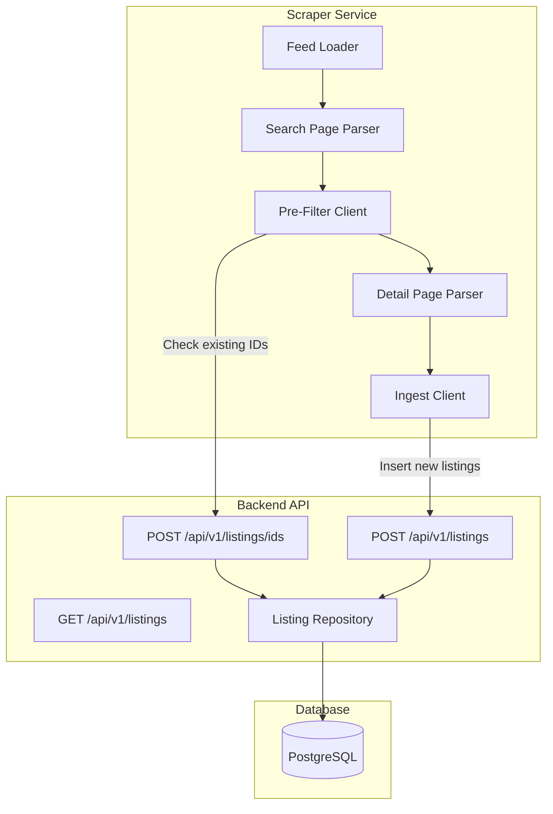
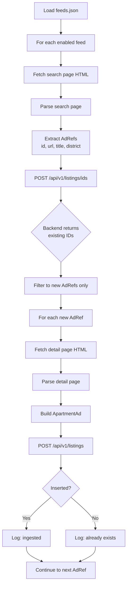
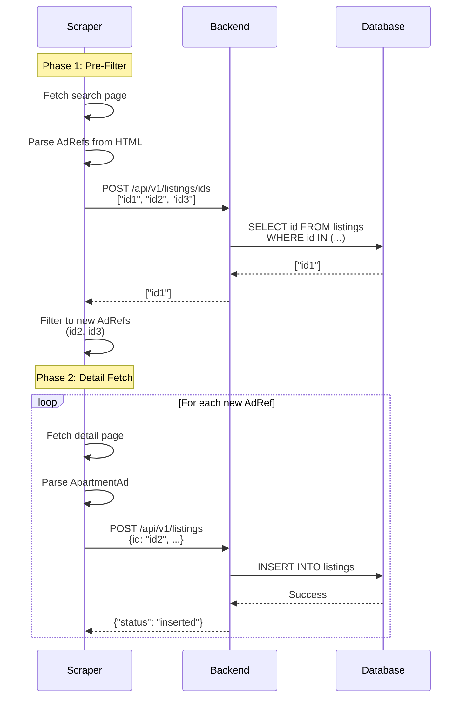
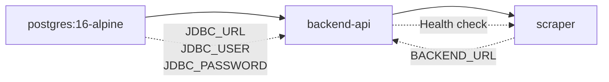

# Flat-Radar Pipeline Documentation

This document describes the data flow from scraping property listings to storing them in the database.

## Overview

The system consists of three main components:
- **Scraper**: Fetches property listings from real estate platforms
- **Backend API**: Receives, deduplicates, and stores listings
- **PostgreSQL**: Persistent storage for all listings

## Architecture



## Two-Phase Scraping Flow

The scraper uses a two-phase approach to minimize unnecessary HTTP requests:



### Phase 1: Pre-Filter

Before fetching detail pages (which are expensive), the scraper:
1. Parses the search page to extract lightweight `AdRef` objects (just ID, URL, title, district)
2. Sends all ad IDs to `POST /api/v1/listings/ids`
3. Receives back the subset of IDs that already exist in the database
4. Filters out existing ads, keeping only new ones

This avoids fetching detail pages for ads we've already seen.

### Phase 2: Detail Fetch & Ingest

For each new ad:
1. Fetch the full detail page HTML
2. Parse it into a complete `ApartmentAd` object with all fields (price, size, rooms, etc.)
3. POST the ad to `POST /api/v1/listings`
4. Backend inserts it if it's truly new (race condition protection)

## Sequence Diagram



## Data Model

### ApartmentAd (DTO)

The shared data transfer object between scraper and backend:

| Field | Type | Description |
|-------|------|-------------|
| id | String | Unique ad identifier from source |
| title | String | Ad title |
| size | Double? | Size in m² |
| rooms | Double? | Number of rooms |
| bedrooms | Int? | Number of bedrooms |
| bathrooms | Int? | Number of bathrooms |
| floor | String? | Floor number |
| apartmentType | String? | Type (e.g., "Apartment", "Penthouse") |
| availableFrom | LocalDate? | Move-in date |
| deposit | Int? | Deposit amount |
| baseRent | Int? | Base rent (Kaltmiete) |
| sideCosts | Int? | Side costs (Nebenkosten) |
| heatingCosts | Int? | Heating costs (Heizkosten) |
| totalRent | Int? | Total rent (Warmmiete) |
| location | String | Location string |
| url | String | URL to the ad |
| source | String | Source platform (e.g., "kleinanzeigen") |
| district | String? | District name |
| timestamp | Long | Unix timestamp (milliseconds) when ad was first seen |

### Database Schema

The `listings` table mirrors the DTO with additional tracking columns:

```sql
CREATE TABLE listings (
    id TEXT PRIMARY KEY,
    title TEXT NOT NULL,
    size DOUBLE PRECISION,
    rooms DOUBLE PRECISION,
    bedrooms INTEGER,
    bathrooms INTEGER,
    floor TEXT,
    apartment_type TEXT,
    available_from DATE,
    deposit INTEGER,
    base_rent INTEGER,
    side_costs INTEGER,
    heating_costs INTEGER,
    total_rent INTEGER,
    location TEXT NOT NULL,
    url TEXT NOT NULL,
    source TEXT NOT NULL,
    district TEXT,
    first_seen BIGINT NOT NULL,  -- Unix timestamp (ms) when first inserted
    last_seen BIGINT NOT NULL    -- Unix timestamp (ms) when last updated
);
```

### Field Mapping

| DTO Field | DB Column | Notes |
|-----------|-----------|-------|
| timestamp | first_seen | On insert, `timestamp` becomes `first_seen` |
| - | last_seen | Set to current time on insert, updated on re-ingest |

## API Endpoints

### POST /api/v1/listings/ids

Pre-filter endpoint to check which IDs already exist.

**Request:**
```json
["id1", "id2", "id3"]
```

**Response:**
```json
["id1"]
```

Returns the subset of IDs that already exist in the database.

### POST /api/v1/listings

Ingest a single listing.

**Request:**
```json
{
  "id": "12345",
  "title": "2-Zi-Wohnung",
  "size": 57.0,
  "rooms": 2.0,
  "totalRent": 1087,
  "location": "22880 Niendorf",
  "url": "https://...",
  "source": "kleinanzeigen",
  "timestamp": 1750000000000
}
```

**Response (inserted):**
```
HTTP 201 Created
{"status": "inserted"}
```

**Response (already exists):**
```
HTTP 200 OK
{"status": "already_exists"}
```

When an ad already exists, `last_seen` is updated to the current time.

### GET /api/v1/listings

Retrieve all stored listings.

**Response:**
```json
[
  {
    "id": "12345",
    "title": "2-Zi-Wohnung",
    "size": 57.0,
    "rooms": 2.0,
    "totalRent": 1087,
    "location": "22880 Niendorf",
    "url": "https://...",
    "source": "kleinanzeigen",
    "timestamp": 1750000000000
  }
]
```

## Deployment

The system runs as Docker containers orchestrated by `docker-compose.yml`:



### Environment Variables

**Backend API:**
- `JDBC_URL`: PostgreSQL connection URL (e.g., `jdbc:postgresql://postgres:5432/flatradar`)
- `JDBC_USER`: Database username
- `JDBC_PASSWORD`: Database password
- `PORT`: HTTP port (default: 8080)

**Scraper:**
- `BACKEND_URL`: Backend API URL (e.g., `http://backend-api:8080`)
- `GEMINI_API_KEY`: Optional, for LLM rent extraction fallback

## Error Handling

- **Scraper failures**: Individual feed failures don't stop the entire run. Errors are logged and the scraper continues with other feeds.
- **Backend failures**: If the backend is unreachable, the scraper logs errors but continues parsing. Listings are not retried automatically.
- **Database failures**: The backend runs Liquibase migrations at startup. If migrations fail, the backend won't start.

## Future Enhancements

- **Discord notifications**: When new listings are inserted, trigger Discord webhook alerts
- **Filtering**: Add price/size/room filters to reduce noise
- **Multiple sources**: Add parsers for ImmoScout24, WG-Gesucht, etc.
- **Scheduled runs**: Add cron-based scheduling instead of one-shot execution
